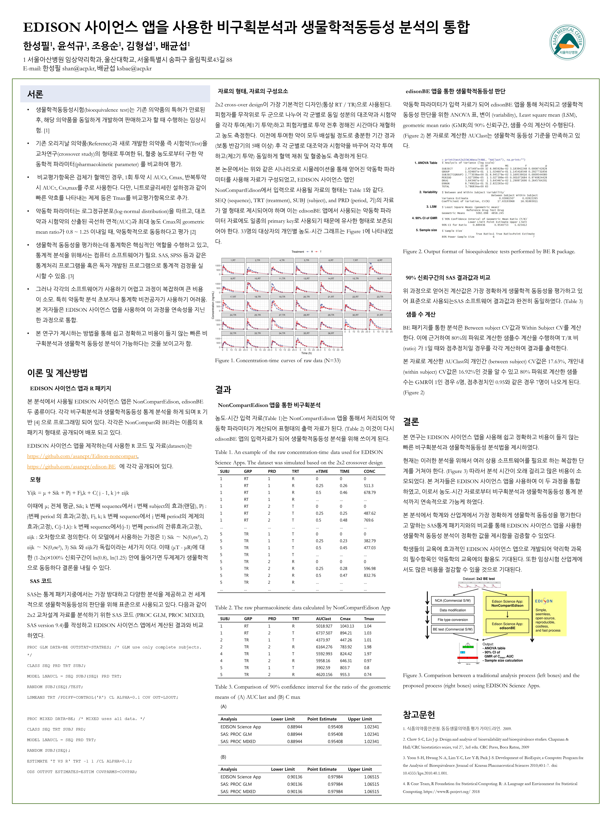
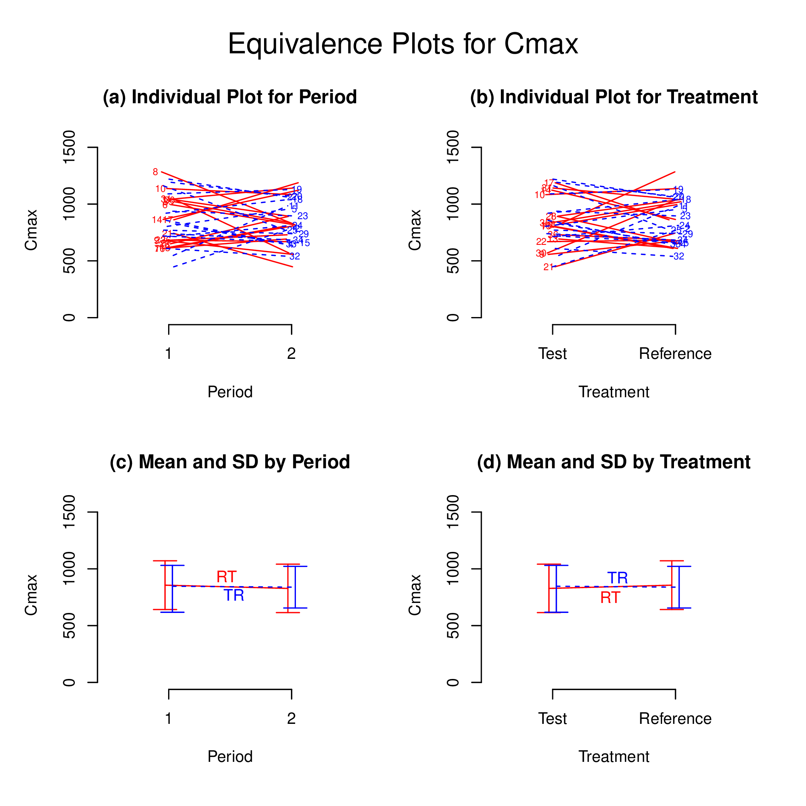
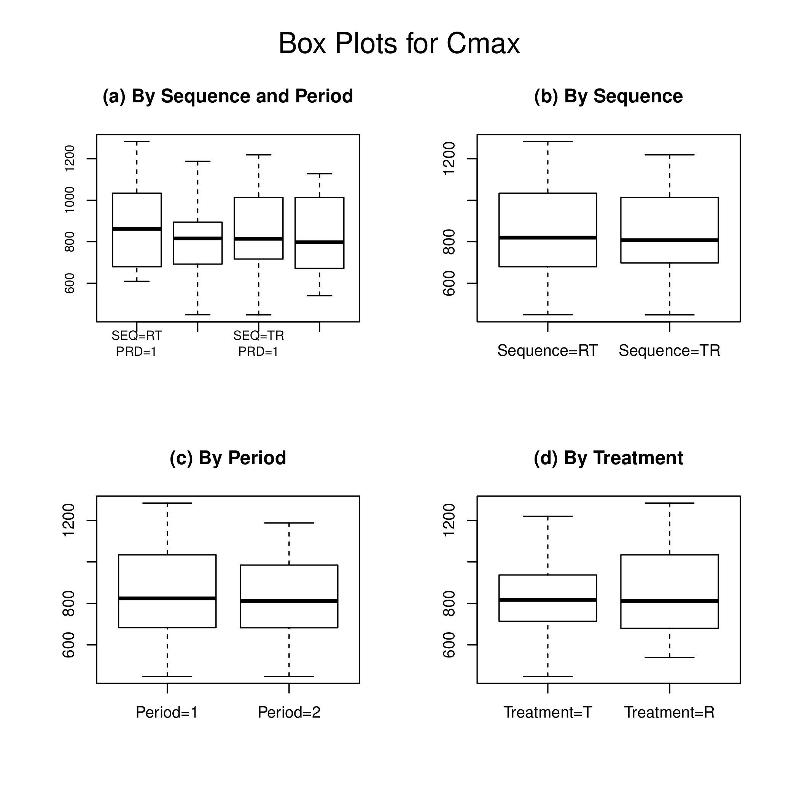
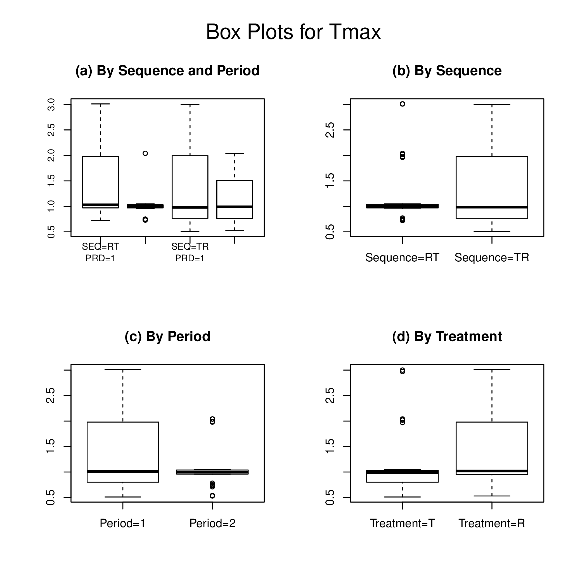

```{r include=FALSE}
library(knitr)
knitr::opts_chunk$set(message = FALSE, warning = FALSE)
options(knitr.kable.NA = '')
```


# Introduction

To assess bioequivalence, the 90% confidence interval for the difference in the means of the log-transformed data should be calculated using appropriate methods to the study design. 
The antilogs (exponents) of the confidence limits obtained constitute the 90% confidence interval for the ratio of the geometric means between the T and R products. [@fda;@chow;@hauschke] 
To establish bioequivalence, the calculated confidence interval should fall within a bioequivalence limit, usually 80-125% for the ratio of the product averages. 
For nonreplicated crossover designs, general linear model procedures available in PROC GLM in SAS are preferred, although linear mixed-effects model procedures can also be indicated for analysis. [@fda]

`BE` R package [@R-BE] can analyze bioequivalence study data with industrial strength. 
The current version of `BE` performs bioequivalency tests for several pharmacokinetic parameters of the conventional two-treatment, two-period, two-sequence (2x2) randomized crossover design. 
The statistical model includes factors accounting for the following sources of variation: sequence (SEQ), subjects nested in sequences (SUBJ(SEQ)), period (PRD), and treatment (TRT). 

In this document, the author performed validation of bioequivalence tests performed by `BE` R package as compared to bioequivalence tests performed by PROC GLM or PROC MIXED in SAS.

# Poster



# Results

```{bash echo = FALSE, result = 'asis'}
cat result/report.txt
```

# Plot

## AUClast


## Cmax




## Tmax

 


# References

```{r}
sessionInfo()
```

