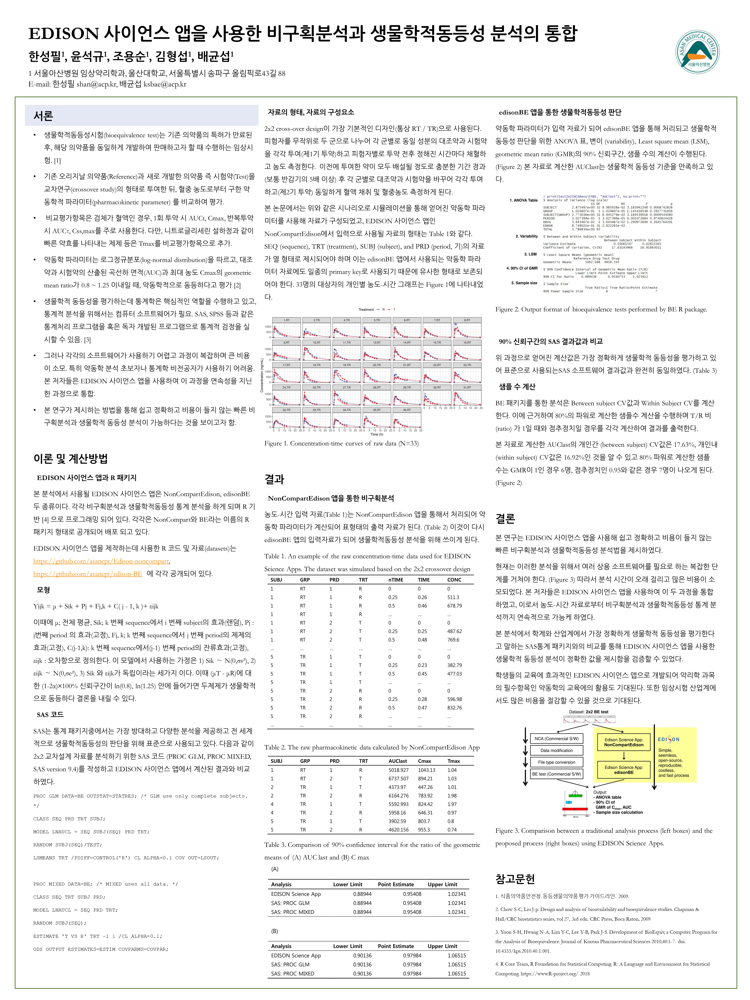
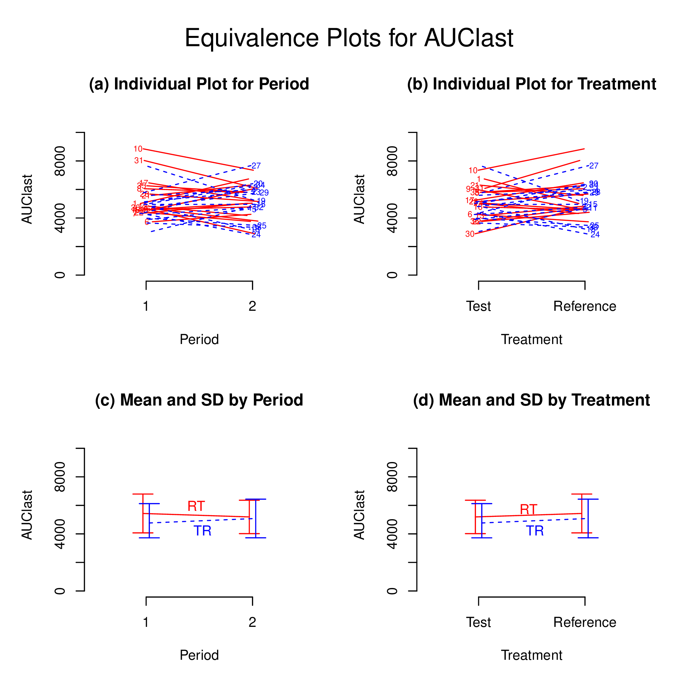
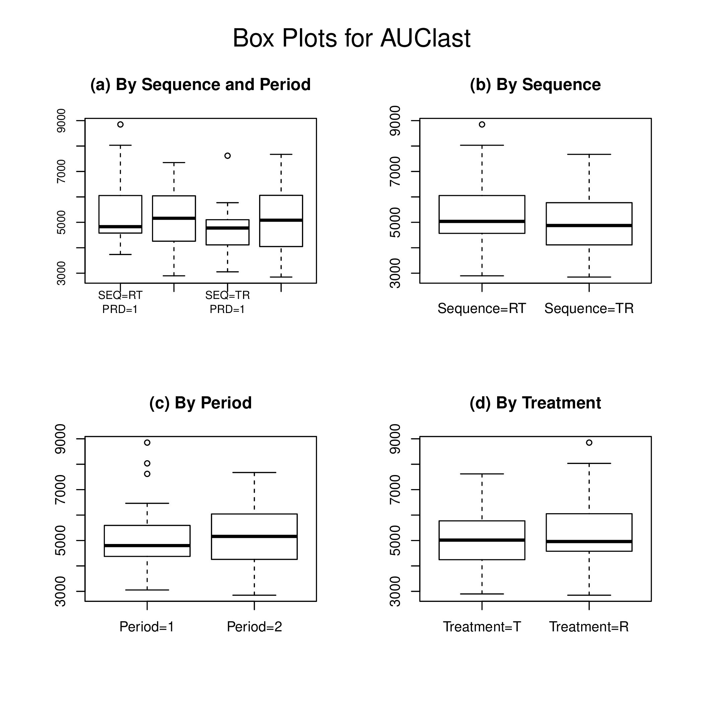
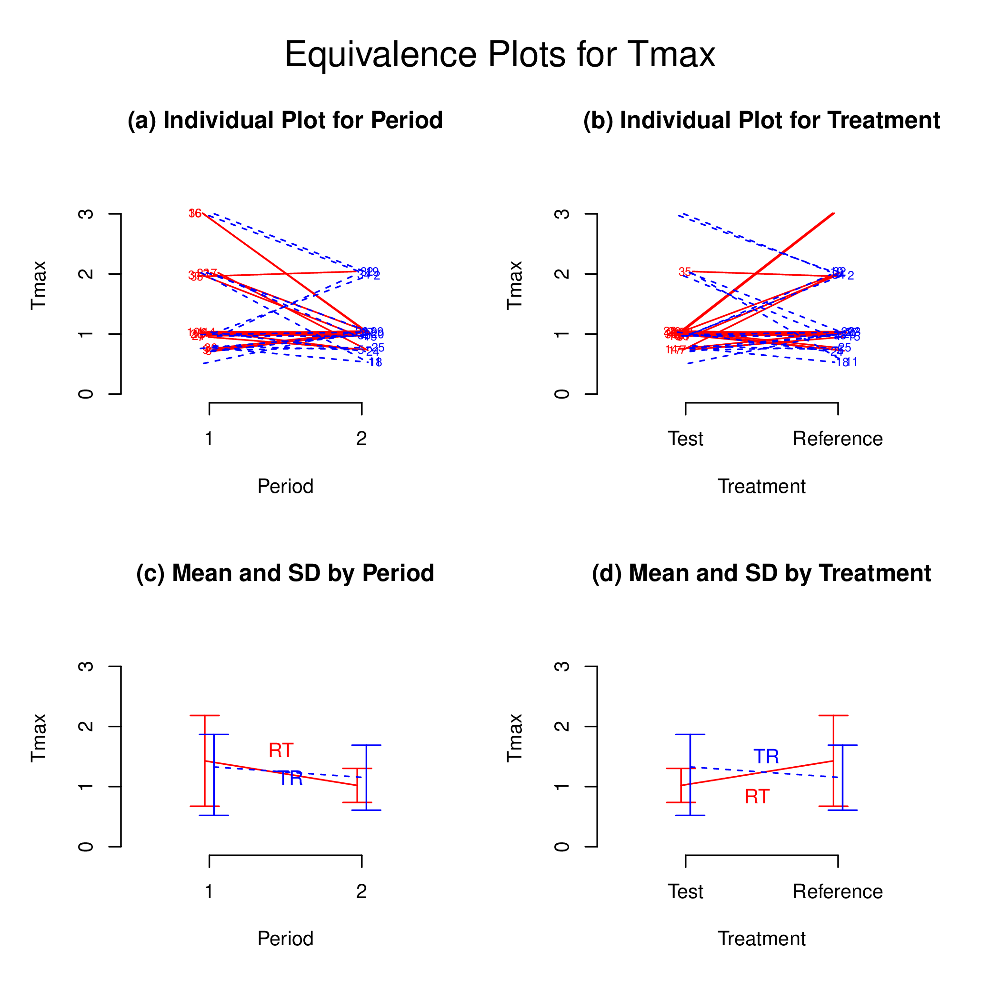
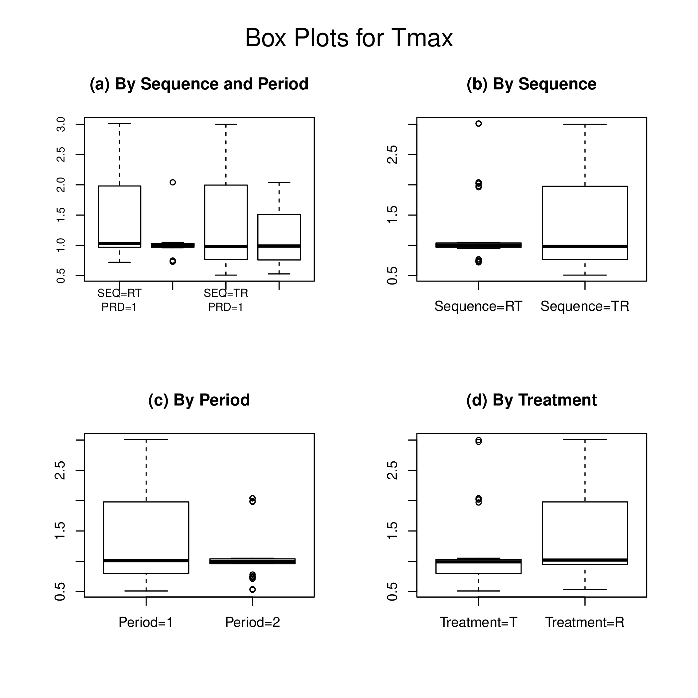

# Introduction

To assess bioequivalence, the 90% confidence interval for the difference
in the means of the log-transformed data should be calculated using
appropriate methods to the study design. The antilogs (exponents) of the
confidence limits obtained constitute the 90% confidence interval for
the ratio of the geometric means between the T and R products.
\[@fda;@chow;@hauschke\] To establish bioequivalence, the calculated
confidence interval should fall within a bioequivalence limit, usually
80-125% for the ratio of the product averages. For nonreplicated
crossover designs, general linear model procedures available in PROC GLM
in SAS are preferred, although linear mixed-effects model procedures can
also be indicated for analysis. \[@fda\]

`BE` R package \[@R-BE\] can analyze bioequivalence study data with
industrial strength. The current version of `BE` performs bioequivalency
tests for several pharmacokinetic parameters of the conventional
two-treatment, two-period, two-sequence (2x2) randomized crossover
design. The statistical model includes factors accounting for the
following sources of variation: sequence (SEQ), subjects nested in
sequences (SUBJ(SEQ)), period (PRD), and treatment (TRT).

In this document, the author performed validation of bioequivalence
tests performed by `BE` R package as compared to bioequivalence tests
performed by PROC GLM or PROC MIXED in SAS.

# Poster



# Results

    ## $AUClast
    ## $AUClast$`Analysis of Variance (log scale)`
    ##                          SS DF           MS           F            p
    ## SUBJECT        2.875497e+00 32 8.985928e-02 3.183942248 0.0008742828
    ## GROUP          1.024607e-01  1 1.024607e-01 1.145416548 0.2927731856
    ## SUBJECT(GROUP) 2.773036e+00 31 8.945279e-02 3.169539016 0.0009544080
    ## PERIOD         3.027399e-05  1 3.027399e-05 0.001072684 0.9740824428
    ## DRUG           3.643467e-02  1 3.643467e-02 1.290972690 0.2645764201
    ## ERROR          8.749021e-01 31 2.822265e-02          NA           NA
    ## TOTAL          3.786834e+00 65           NA          NA           NA
    ## 
    ## $AUClast$`Between and Within Subject Variability`
    ##                                 Between Subject Within Subject
    ## Variance Estimate                    0.03061507     0.02822265
    ## Coefficient of Variation, CV(%)     17.63193968    16.91883011
    ## 
    ## $AUClast$`Least Square Means (geometric mean)`
    ##                 Reference Drug Test Drug
    ## Geometric Means       5092.098  4858.245
    ## 
    ## $AUClast$`90% Confidence Interval of Geometric Mean Ratio (T/R)`
    ##                  Lower Limit Point Estimate Upper Limit
    ## 90% CI for Ratio    0.889436      0.9540753    1.023412
    ## 
    ## $AUClast$`Sample Size`
    ##                       True Ratio=1 True Ratio=Point Estimate
    ## 80% Power Sample Size            6                         7
    ## 
    ## 
    ## $Cmax
    ## $Cmax$`Analysis of Variance (log scale)`
    ##                          SS DF           MS           F          p
    ## SUBJECT        2.861492e+00 32 8.942162e-02 2.237604579 0.01367095
    ## GROUP          9.735789e-05  1 9.735789e-05 0.001054764 0.97429977
    ## SUBJECT(GROUP) 2.861394e+00 31 9.230304e-02 2.309706785 0.01131826
    ## PERIOD         4.717497e-03  1 4.717497e-03 0.118046317 0.73348258
    ## DRUG           6.837756e-03  1 6.837756e-03 0.171101730 0.68198228
    ## ERROR          1.238856e+00 31 3.996310e-02          NA         NA
    ## TOTAL          4.112258e+00 65           NA          NA         NA
    ## 
    ## $Cmax$`Between and Within Subject Variability`
    ##                                 Between Subject Within Subject
    ## Variance Estimate                    0.02616997      0.0399631
    ## Coefficient of Variation, CV(%)     16.28355371     20.1921690
    ## 
    ## $Cmax$`Least Square Means (geometric mean)`
    ##                 Reference Drug Test Drug
    ## Geometric Means       825.5206  808.8778
    ## 
    ## $Cmax$`90% Confidence Interval of Geometric Mean Ratio (T/R)`
    ##                  Lower Limit Point Estimate Upper Limit
    ## 90% CI for Ratio   0.9013625      0.9798396    1.065149
    ## 
    ## $Cmax$`Sample Size`
    ##                       True Ratio=1 True Ratio=Point Estimate
    ## 80% Power Sample Size            8                         8
    ## 
    ## 
    ## $Tmax
    ## $Tmax$`Wilcoxon Signed-Rank Test`
    ##   p-value 
    ## 0.2326894 
    ## 
    ## $Tmax$`Hodges-Lehmann Estimate`
    ##                            Lower Limit Point Estimate Upper Limit
    ## 90% Confidence Interval       -0.33000       -0.03500      0.1050
    ## 90% Confidence Interval(%)    74.37661       97.28237    108.1529

# Plot

## AUClast

 

## Cmax

 

## Tmax

 

# References

``` r
sessionInfo()
```

    ## R version 3.6.3 (2020-02-29)
    ## Platform: x86_64-w64-mingw32/x64 (64-bit)
    ## Running under: Windows 10 x64 (build 17763)
    ## 
    ## Matrix products: default
    ## 
    ## locale:
    ## [1] LC_COLLATE=Korean_Korea.949  LC_CTYPE=Korean_Korea.949   
    ## [3] LC_MONETARY=Korean_Korea.949 LC_NUMERIC=C                
    ## [5] LC_TIME=Korean_Korea.949    
    ## 
    ## attached base packages:
    ## [1] stats     graphics  grDevices utils     datasets  methods   base     
    ## 
    ## other attached packages:
    ## [1] knitr_1.28
    ## 
    ## loaded via a namespace (and not attached):
    ##  [1] compiler_3.6.3  magrittr_1.5    tools_3.6.3     htmltools_0.4.0
    ##  [5] Rcpp_1.0.4.6    stringi_1.4.6   rmarkdown_2.1   stringr_1.4.0  
    ##  [9] xfun_0.12       digest_0.6.25   rlang_0.4.5     evaluate_0.14
