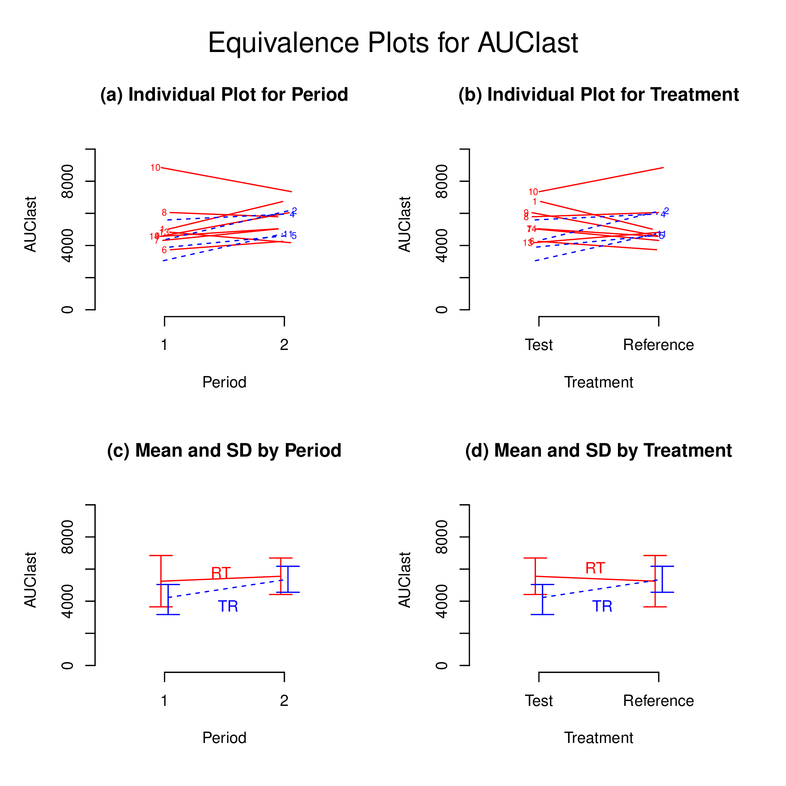
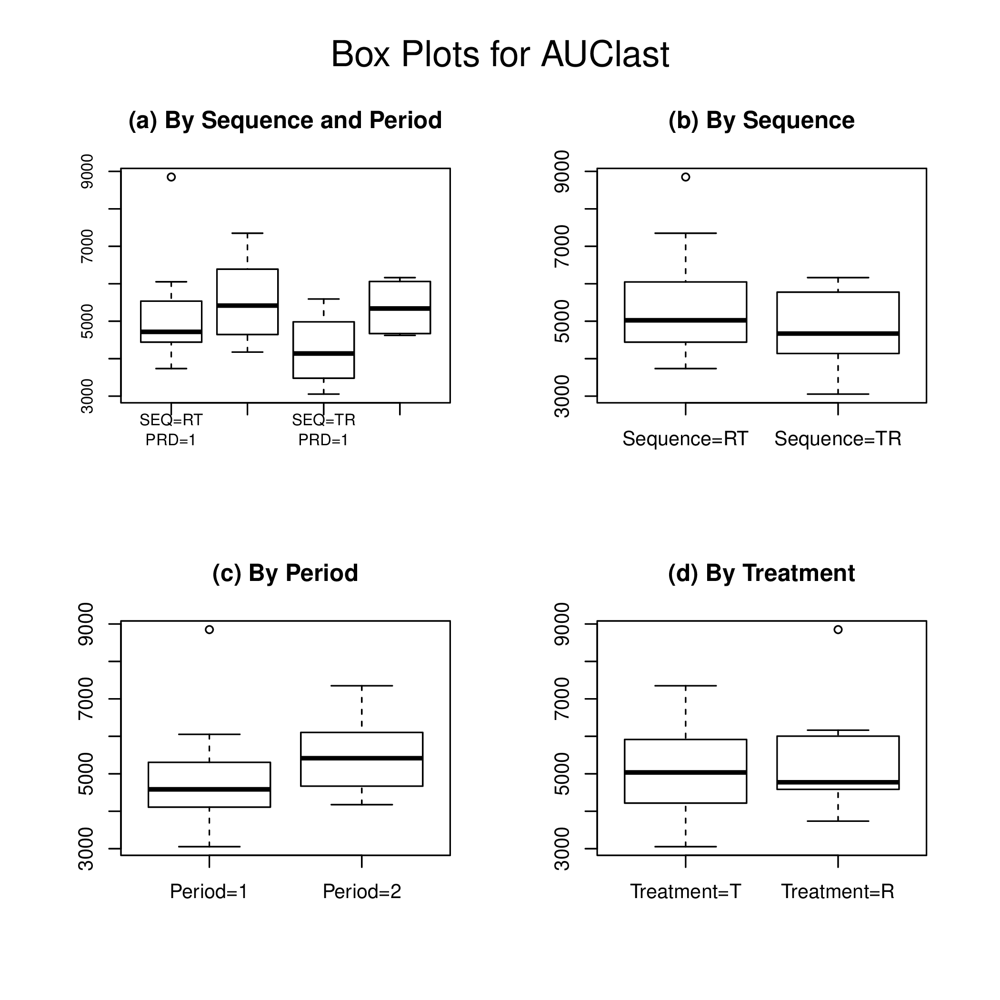
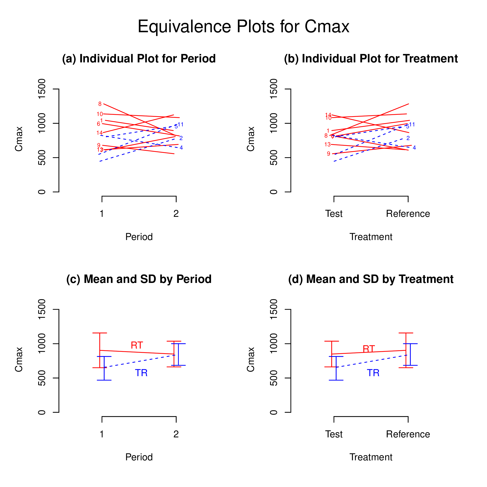
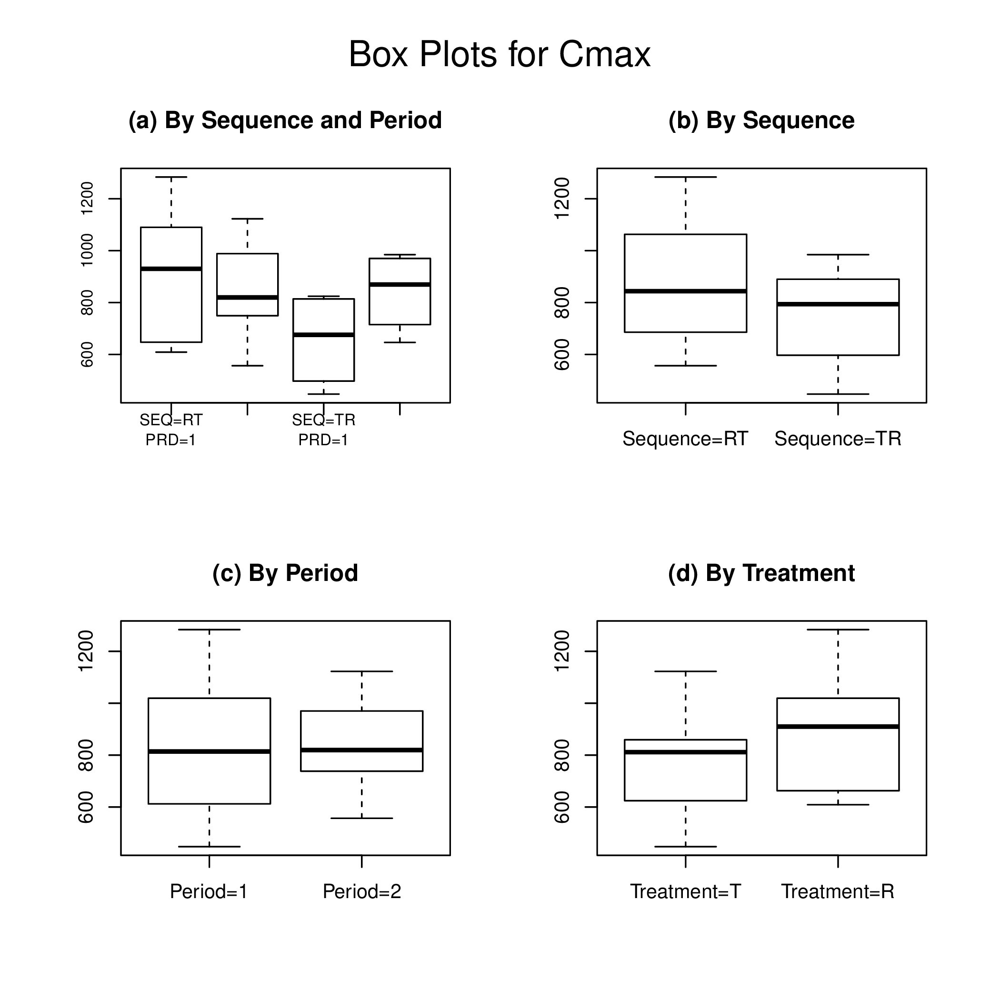
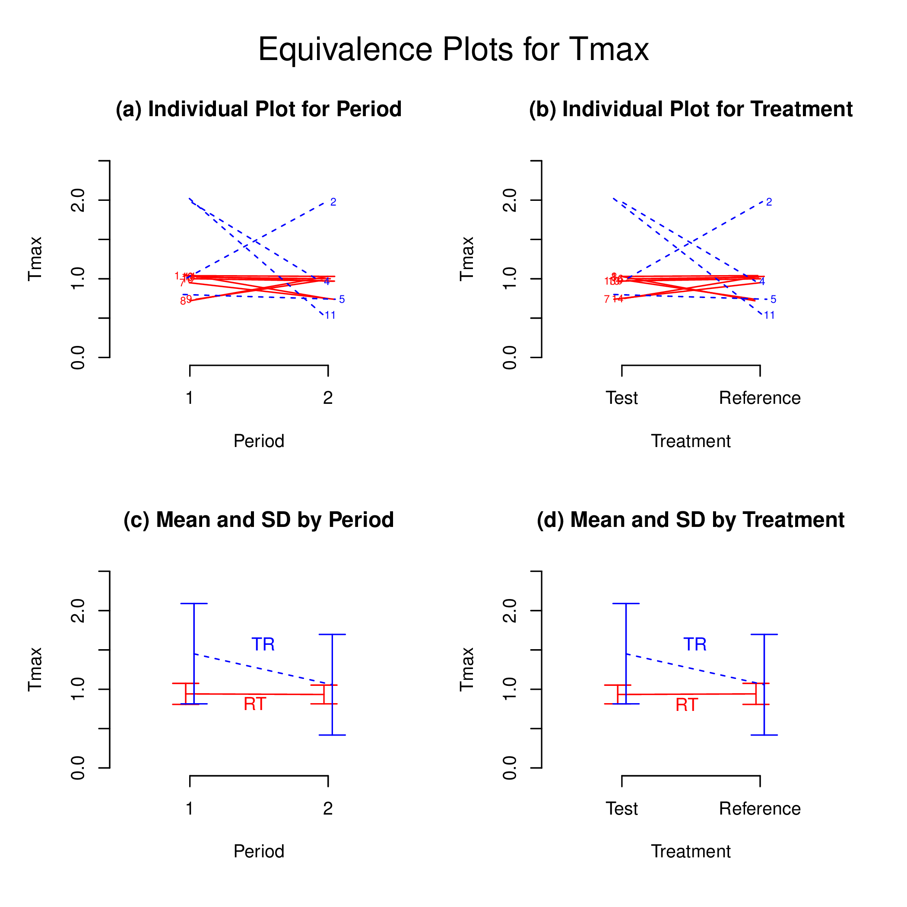
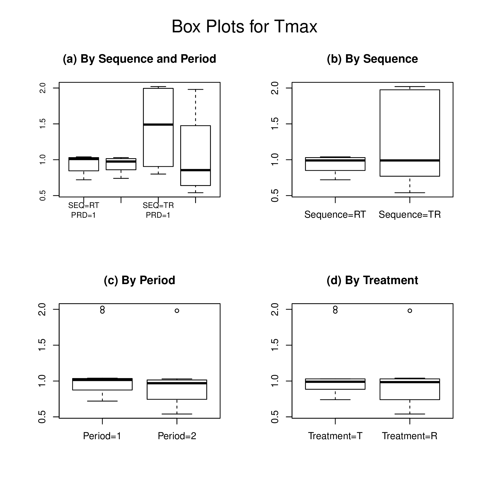

# Introduction

To assess bioequivalence, the 90% confidence interval for the difference in the means of the log-transformed data should be calculated using appropriate methods to the study design. 
The antilogs (exponents) of the confidence limits obtained constitute the 90% confidence interval for the ratio of the geometric means between the T and R products. [@fda;@chow;@hauschke] 
To establish bioequivalence, the calculated confidence interval should fall within a bioequivalence limit, usually 80-125% for the ratio of the product averages. 
For nonreplicated crossover designs, general linear model procedures available in PROC GLM in SAS are preferred, although linear mixed-effects model procedures can also be indicated for analysis. [@fda]

`BE` R package [@R-BE] can analyze bioequivalence study data with industrial strength. 
The current version of `BE` performs bioequivalency tests for several pharmacokinetic parameters of the conventional two-treatment, two-period, two-sequence (2x2) randomized crossover design. 
The statistical model includes factors accounting for the following sources of variation: sequence (SEQ), subjects nested in sequences (SUBJ(SEQ)), period (PRD), and treatment (TRT). 

In this document, the author performed validation of bioequivalence tests performed by `BE` R package as compared to bioequivalence tests performed by PROC GLM or PROC MIXED in SAS.

# Results


```
## $AUClast
## $AUClast$`Analysis of Variance (log scale)`
##                        SS DF         MS        F           p
## SUBJECT        0.94975183 11 0.08634108 5.535104 0.005765629
## GROUP          0.07059498  1 0.07059498 0.802985 0.391263228
## SUBJECT(GROUP) 0.87915685 10 0.08791568 5.636048 0.005744766
## PERIOD         0.14033475  1 0.14033475 8.996499 0.013356966
## DRUG           0.04354548  1 0.04354548 2.791589 0.125713424
## ERROR          0.15598817 10 0.01559882       NA          NA
## TOTAL          1.25397585 23         NA       NA          NA
## 
## $AUClast$`Between and Within Subject Variability`
##                                 Between Subject Within Subject
## Variance Estimate                    0.03615843     0.01559882
## Coefficient of Variation, CV(%)     19.18856461    12.53838639
## 
## $AUClast$`Least Square Means (geometric mean)`
##                 Reference Drug Test Drug
## Geometric Means        5195.63  4746.743
## 
## $AUClast$`90% Confidence Interval of Geometric Mean Ratio (T/R)`
##                  Lower Limit Point Estimate Upper Limit
## 90% CI for Ratio   0.8283005       0.913603     1.00769
## 
## $AUClast$`Sample Size`
##                       True Ratio=1 True Ratio=Point Estimate
## 80% Power Sample Size            4                         7
## 
## 
## $Cmax
## $Cmax$`Analysis of Variance (log scale)`
##                        SS DF         MS        F         p
## SUBJECT        1.00932428 11 0.09175675 2.031077 0.1372485
## GROUP          0.13411132  1 0.13411132 1.532328 0.2440384
## SUBJECT(GROUP) 0.87521296 10 0.08752130 1.937323 0.1560057
## PERIOD         0.06523089  1 0.06523089 1.443915 0.2571915
## DRUG           0.13429752  1 0.13429752 2.972736 0.1153959
## ERROR          0.45176403 10 0.04517640       NA        NA
## TOTAL          1.61536022 23         NA       NA        NA
## 
## $Cmax$`Between and Within Subject Variability`
##                                 Between Subject Within Subject
## Variance Estimate                    0.02117245      0.0451764
## Coefficient of Variation, CV(%)     14.62811443     21.4970692
## 
## $Cmax$`Least Square Means (geometric mean)`
##                 Reference Drug Test Drug
## Geometric Means       851.0539  726.1749
## 
## $Cmax$`90% Confidence Interval of Geometric Mean Ratio (T/R)`
##                  Lower Limit Point Estimate Upper Limit
## 90% CI for Ratio   0.7221693      0.8532655     1.00816
## 
## $Cmax$`Sample Size`
##                       True Ratio=1 True Ratio=Point Estimate
## 80% Power Sample Size            9                        68
## 
## 
## $Tmax
## $Tmax$`Wilcoxon Signed-Rank Test`
##   p-value 
## 0.1838384 
## 
## $Tmax$`Hodges-Lehmann Estimate`
##                            Lower Limit Point Estimate Upper Limit
## 90% Confidence Interval       -0.49500         0.2725       0.655
## 90% Confidence Interval(%)    50.46904       127.2670     165.541
```

# Plot

## AUClast




## Cmax




## Tmax

 



# References


```r
sessionInfo()
```

```
## R version 3.5.2 (2018-12-20)
## Platform: x86_64-w64-mingw32/x64 (64-bit)
## Running under: Windows 7 x64 (build 7601) Service Pack 1
## 
## Matrix products: default
## 
## locale:
## [1] LC_COLLATE=Korean_Korea.949  LC_CTYPE=Korean_Korea.949   
## [3] LC_MONETARY=Korean_Korea.949 LC_NUMERIC=C                
## [5] LC_TIME=Korean_Korea.949    
## 
## attached base packages:
## [1] stats     graphics  grDevices utils     datasets  methods   base     
## 
## other attached packages:
## [1] knitr_1.21     bindrcpp_0.2.2 purrr_0.2.5    readr_1.3.1   
## [5] tibble_1.4.2   tidyr_0.8.2    dplyr_0.7.8    BE_0.1.1      
## [9] rtf_0.4-13    
## 
## loaded via a namespace (and not attached):
##  [1] Rcpp_1.0.0        bindr_0.1.1       magrittr_1.5     
##  [4] hms_0.4.2         tidyselect_0.2.5  R6_2.3.0         
##  [7] rlang_0.3.0.1     fansi_0.4.0       stringr_1.3.1    
## [10] tools_3.5.2       xfun_0.4          R.oo_1.22.0      
## [13] utf8_1.1.4        cli_1.0.1         assertthat_0.2.0 
## [16] crayon_1.3.4      evaluate_0.12     glue_1.3.0       
## [19] stringi_1.2.4     compiler_3.5.2    pillar_1.3.1     
## [22] R.methodsS3_1.7.1 pkgconfig_2.0.2
```

